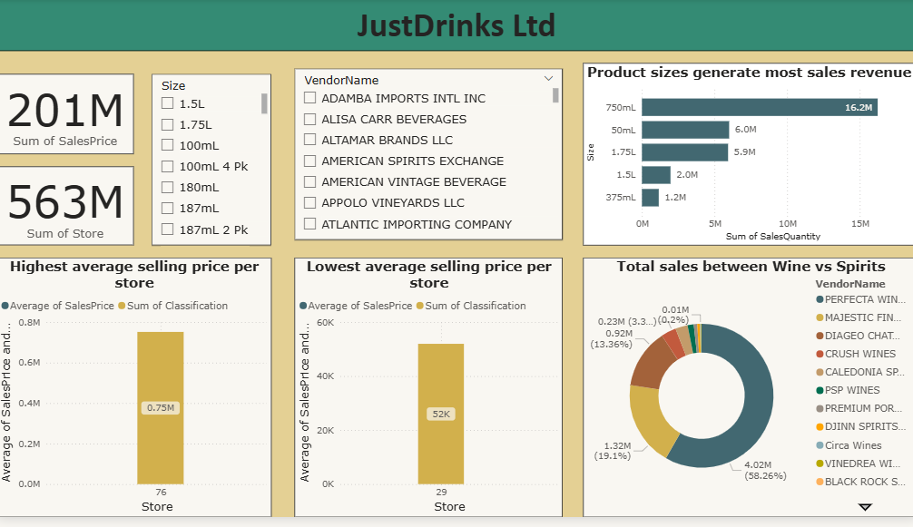
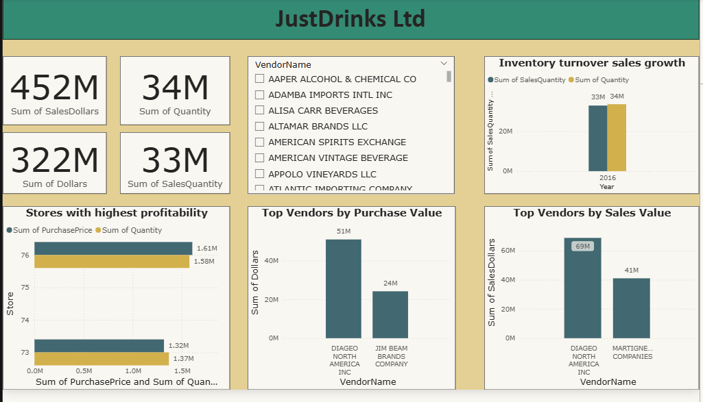
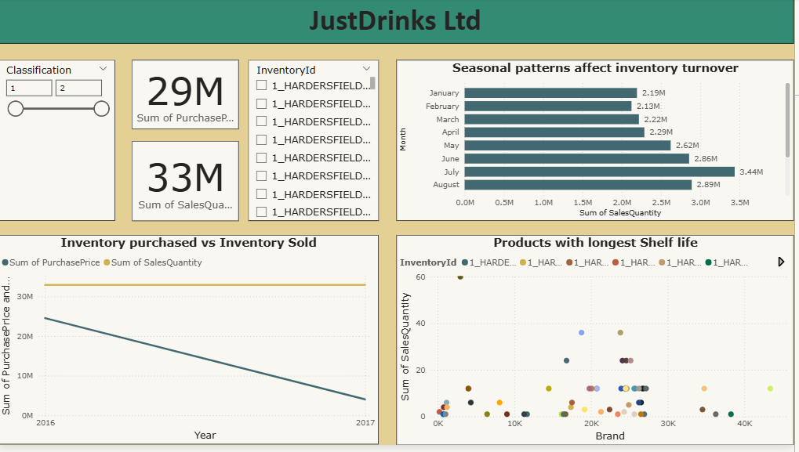

# Capstone_JustDrinksLtd_Power_BI

# JustDrinks Ltd. -  Business Intelligence Dashboard

## 📊 Project Overview

This repository hosts the **JustDrinks Ltd. Business Intelligence Dashboard**, a comprehensive Power BI solution designed to analyze sales performance, inventory turnover, store profitability, and vendor relationships for a beverage distribution company.

The dashboard provides actionable insights into **$452M+ in sales revenue**, tracking performance across various product sizes, store locations, and supplier networks to optimize supply chain decisions.

## 🔍 Business Problem

JustDrinks Ltd. faced challenges in consolidating data across inventory purchasing, store sales, and vendor management. The stakeholders needed a centralized view to answer critical questions:
* Which product sizes and brands drive the most revenue?
* How does seasonality affect inventory turnover?
* Which stores are the most profitable versus which have the lowest average selling prices?
* Who are the top-performing vendors in terms of sales vs. purchase costs?

## 💡 Key Features & Insights

### 1. Sales & Revenue Analysis
* **Revenue Overview:** The dashboard tracks over **$452M in Total Sales** and **33M units sold**.
* **Product Size Preferences:** The **750mL** bottle size is the clear market leader, generating **16.2M** in sales quantity, significantly outperforming 50mL (6.0M) and 1.75L (5.9M) formats.
* **Vendor Dominance:** **Diageo North America** is the top vendor by a significant margin, leading in both sales value ($69M) and purchase value ($51M).

### 2. Inventory & Seasonality
* **Seasonal Trends:** Analysis reveals a distinct seasonal spike in sales during the summer months, with **July peaking at 3.44M units** and June at 2.86M units.
* **Inventory Turnover:** Visualizes the relationship between inventory purchased vs. inventory sold from 2016 to 2017, highlighting areas where stock levels may be exceeding demand.
* **Shelf Life Analysis:** A scatter plot analysis identifies products with the longest shelf life by comparing Brand vs. Sales Quantity.

### 3. Store Performance & Profitability
* **High vs. Low Performers:**
    * **Store 76** has the highest average selling price per store ($0.75M avg).
    * **Store 29** and **Store 59** are identified as having the lowest average selling prices.
* **Profitability Metrics:** Drills down into specific store data (e.g., Store 76, 73) to compare Purchase Price sums against Quantity sold to calculate margin efficiency.

### 4. Supply Chain & Vendor Management
* **Purchase Trends:** Tracks total purchases (Purchase Price vs. Quantity) by vendor.
* **Supplier Frequency:** A 12-month trend line analyzes vendor purchase frequency, showing peak restocking periods in late Q3/early Q4 (September/October).
* **Category Split:** A breakdown of "Wine vs. Spirits" shows the portfolio distribution, heavily weighted towards specific major vendors like *Perfecta Wines* and *Majestic Fine Wines*.

## 🛠️ Tech Stack

* **Platform:** Microsoft Power BI
* **Data Sources:** SQL / Excel (Sales, Purchase Orders, Inventory, Store Data)
* **Key Techniques:**
    * **Data Modeling:** Star Schema relationship connecting Sales, Purchases, and Inventory tables.
    * **DAX Measures:** Custom calculations for *Total Sales*, *Average Selling Price*, *Inventory Turnover*, and *Profitability*.
    * **Interactive Elements:** Slicers for *VendorName*, *Store ID*, *Container Size*, and *Date Hierarchies*.

## 📷 Dashboard Previews

### Sales Overview
*Analysis of product sizes and revenue distribution.*

### Profitability & Vendors
*Top vendors by sales value and store profitability rankings.*

### Inventory Intelligence
*Seasonal patterns and inventory purchase vs. sold trends.*

## 🚀 How to Use

1.  **Filter by Vendor:** Use the sidebar slicers to isolate performance for specific suppliers (e.g., *Diageo*, *Jim Beam*).
2.  **Drill into Stores:** Use the Store slider to focus on specific store ID ranges to analyze local performance.
3.  **Time Intelligence:** Interact with the Month/Quarter filters to see how sales trends shift during holidays vs. summer months.

## 📈 Future Improvements

* **Predictive Analytics:** Implement Python/R integration in Power BI to forecast inventory needs for the upcoming July peak.
* **Geospatial Mapping:** Add map visualizations to plot store profitability by geographic region.
* **Basket Analysis:** Create a "Products Often Purchased Together" view to drive cross-selling strategies.

---

**Author:** Salome Kungu
